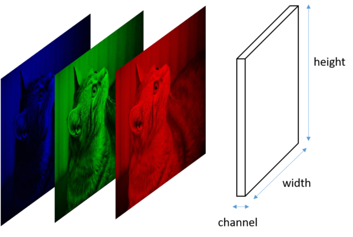
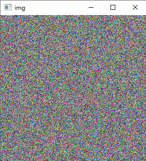
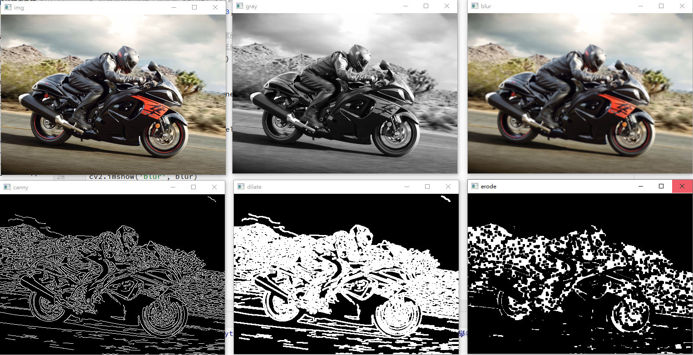
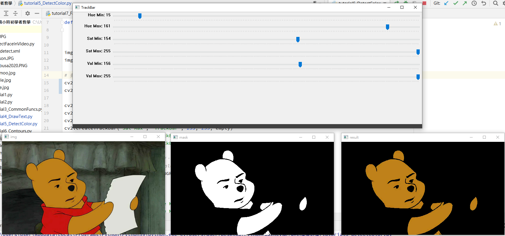
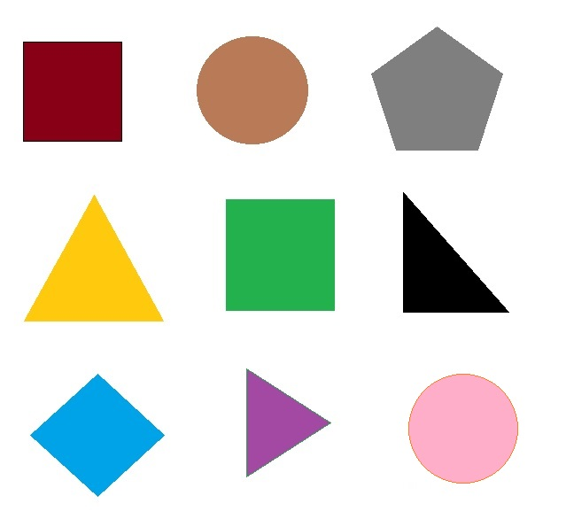
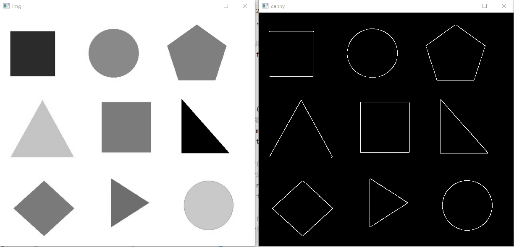
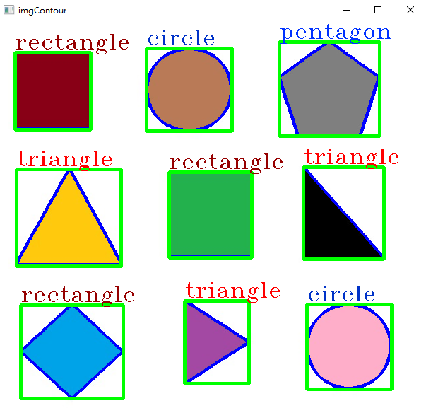

# opencv 2 小時初學者教學

## 目錄

- [opencv 2 小時初學者教學](#opencv-2-小時初學者教學)
  - [目錄](#目錄)
  - [一、基本概念 : 電腦眼中的圖片](#一基本概念--電腦眼中的圖片)
  - [二、安裝 opencv \& 讀取影片、讀取圖片](#二安裝-opencv--讀取影片讀取圖片)
  - [三、numpy 與圖片關係](#三numpy-與圖片關係)
  - [四、常用函式 ( cvtColor 色彩轉換、GaussianBlur 高斯模糊、Canny 邊緣檢測、dilate 膨脹、erode 侵蝕 )](#四常用函式--cvtcolor-色彩轉換gaussianblur-高斯模糊canny-邊緣檢測dilate-膨脹erode-侵蝕-)
    - [圖片預處理](#圖片預處理)
  - [五、畫圖形、寫字 ( line 畫直線、rectangle 畫矩形、circle 畫圓形、putText 寫字 )](#五畫圖形寫字--line-畫直線rectangle-畫矩形circle-畫圓形puttext-寫字-)
  - [六、偵測顏色 ( Track bar 控制條、inRange 過濾範圍、bitwise\_and )](#六偵測顏色--track-bar-控制條inrange-過濾範圍bitwise_and-)
  - [七、輪廓檢測 、形狀辨識 ( findContours 找輪廓、drawContours 畫輪廓、contourArea 輪廓面積、arcLength 輪廓總長、approxPolyDP 近似多邊形、boundingRect 外接矩形 )](#七輪廓檢測-形狀辨識--findcontours-找輪廓drawcontours-畫輪廓contourarea-輪廓面積arclength-輪廓總長approxpolydp-近似多邊形boundingrect-外接矩形-)
- [八、人臉辨識 ( CascadeClassifier 載入模型、detectMultiScale 偵測 )](#八人臉辨識--cascadeclassifier-載入模型detectmultiscale-偵測-)
  - [References](#references)

## 一、基本概念 : 電腦眼中的圖片

- 組成圖像大小的最小單位 ⇒ **Pixel** 畫素
- Width \* Height ⇒ resolution 解析度
- 現金電腦多採 Gray Scale Image 灰階圖像
  - 8 bits = 2^8 = 256 levels (0 ~255 的灰階值)
- RGB = Red + Green + Blue
  - 一種表達顏色的方式
  - width \* height \* channel
    

## 二、安裝 opencv & 讀取影片、讀取圖片

1.  打開 terminal

    ```python
    pip install opencv-python
    ```

2.  執行指令前先導入 package

    ```python
    import cv2
    ```

3.  讀取、調整大小、顯示圖片

    ```python
    # 圖片
    img = cv2.imread('moomoo.jpg')
    img = cv2.resize(img, (0, 0), fy=0.5, fx=0.5)  # 調整大小

    cv2.imshow('img', img)
    cv2.waitKey(0)  # 隨意按按鍵便回結束，最多等待 n 秒結束，若想無限時間就設 0
    ```

4.  讀取影片 — 把影片分成很多 frame 在 show 出來
    使用 `cv2.waitKey()` 做延遲

    ```python
    # 影片
    cap = cv2.VideoCapture('阿北生氣.mp4')
    while True: # 讀取每一幀去播放影片
    ret, frame = cap.read() # 回傳兩個值(boolean, next frame)
    if ret:
    frame = cv2.resize(frame, (0, 0), fx=0.5, fy=0.5)
    cv2.imshow('video', frame)
    else:
    break
    if cv2.waitKey(1) == ord('q'): # 如果按下 q 就會跳出
    break

        cap.release()
        cv2.destroyAllWindows()

    ```

5.  讀取鏡頭

    ```python
    # 取得視訊鏡頭
    cap = cv2.VideoCapture(0)  # 括號裡面的值是鏡頭編號
    while True:  # 讀取每一幀去播放影片
        ret, frame = cap.read()  # 回傳兩個值(boolean, next frame)
        if ret:
            frame = cv2.resize(frame, (0, 0), fx=1.5, fy=1.5)
            cv2.imshow('video', frame)
        else:
            break
        if cv2.waitKey(1) == ord('q'):  # 如果按下 q 就會跳出
            break

    cap.release()
    cv2.destroyAllWindows()
    ```

## 三、numpy 與圖片關係

- 做圖

  1. 導入 `numpy`

     ```python
     import cv2
     import numpy as np
     import random
     ```

  2. 為何要 numpy ? Ans : 展開圖像(三維矩陣)

     ```python
     img = np.empty((300, 300, 3), np.uint8)  # 製作一個300 * 300 * 3 的圖，無值
     img2 = np.zeros((300, 300, 3), np.uint8)  # 製作一個300 * 300 * 3 的圖，值為 0
     # uint8 是專門用於儲存圖像的矩陣類型
     ```

  3. 填顏色

     ```python
     # fill color
     for row in range(300):
         for col in range(300):
             img[row][col] = [random.randint(0, 255), random.randint(0, 255), random.randint(0, 255)]
     cv2.imshow('img', img)
     cv2.waitKey(0)
     ```

  - 結果
    

- 可以使用 `[]` 切割圖片
  ```python
  img = cv2.imread('moomoo.jpg')
  print(img.shape) # 圖片陣列大小 (2048, 2048, 3)
                   # R G B，但在 opencv 中的順序是 B G R
  newImg = img[300:600, 300:600]  # 切割圖片
  ```

## 四、常用函式 ( cvtColor 色彩轉換、GaussianBlur 高斯模糊、Canny 邊緣檢測、dilate 膨脹、erode 侵蝕 )

### 圖片預處理

```python
import cv2

# 導入圖片並調整大小
img = cv2.imread('hayabusa.PNG')
img = cv2.resize(img, (0, 0), fx=0.2, fy=0.2)

# BGR 轉 灰階
gray = cv2.cvtColor(img, cv2.COLOR_BGR2GRAY)

kernel1 = np.ones((3, 3), np.uint8)  # kernel size 只能是奇數

# 1. blur 模糊化 : 可以去除照片上的雜訊
# 這邊用高斯模糊，中間是 kernel size (越大越模糊)，後者為標準差
blur = cv2.GaussianBlur(img, (3,3), 10)

# 2. edge cascade 邊緣偵測 : 找圖片輪廓邊緣 (src, 最低門檻值, 最高門檻值)
# 兩像素差異高過最高門檻值就當邊緣來看，低於就過濾掉
# 會變成二值圖
canny = cv2.Canny(img, 50, 110)

# 3. dilate 膨脹 : 線條變粗
dilate = cv2.dilate(canny, kernel1, iterations=1)

# 4. erode 侵蝕 : 線條變細
erode = cv2.erode(dilate, kernel1, iterations=2)
```

**結果**



## 五、畫圖形、寫字 ( line 畫直線、rectangle 畫矩形、circle 畫圓形、putText 寫字 )

1. 導入套件

   ```python
   import cv2
   import numpy as np
   ```

2. 展開圖像

   ```python
   img = np.zeros((600, 600, 3), np.uint8)
   ```

3. 畫圖

   ```python
   # 1. 畫直線 (圖像, 起始, 終點, 顏色, 粗度)
   cv2.line(img, (0, 0), (img.shape[1], img.shape[0]), (0, 255, 0), thickness=2)

   # 2. 方形 (圖像, 起始, 終點, 顏色, 粗度)
   # 若要填滿thickness=-1
   cv2.rectangle(img, (150, 150), (450, 450), (255, 0, 0), cv2.FILLED)

   # 3. 圓型 (圖像, 圓心, 半徑, 顏色, 粗度)
   # 若要填滿thickness=-1
   cv2.circle(img, (img.shape[1] // 2, img.shape[0] // 2), 300, (0, 0, 255), thickness=4)

   # 4. 加字() (圖像, 字, 位置, 字體, 大小, 顏色, 粗度)
   cv2.putText(img, 'Hello World!', (125, 350), cv2.FONT_HERSHEY_SIMPLEX, 2, (255, 255, 255), thickness=1)

   cv2.imshow('img', img)
   cv2.waitKey(0)
   ```

**結果**


## 六、偵測顏色 ( Track bar 控制條、inRange 過濾範圍、bitwise_and )

1.  導入套件 & 匯入圖片

    ```python
    import cv2
    import numpy as np

    img = cv2.imread('winnie.jpg')
    img = cv2.resize(img, (0, 0), fx=0.5, fy=0.5)
    ```

2.  控制條 TrackBar

    ```python
    cv2.namedWindow('TrackBar')  # 命名
    cv2.resizeWindow('TrackBar', 1200, 400)  # 調整大小

    def empty(v):  # 回調函數，先不管它 pass
    	pass

    cv2.createTrackbar('Hue Min', 'TrackBar', 0, 179, empty)
    cv2.createTrackbar('Hue Max', 'TrackBar', 179, 179, empty)
    cv2.createTrackbar('Sat Min', 'TrackBar', 0, 255, empty)
    cv2.createTrackbar('Sat Max', 'TrackBar', 255, 255, empty)
    cv2.createTrackbar('Val Min', 'TrackBar', 0, 255, empty)
    cv2.createTrackbar('Val Max', 'TrackBar', 255, 255, empty)
    ```

3.  要偵測顏色的話要先把 BGR 轉承 HSV，因為 HSV 較 BGR 更為容易過濾顏色
    BGR 跟 HSV (Hue Saturation 飽和度 Value 亮度) 都是表達顏色的方式

    ````python

        # BGR 跟 HSV (Hue Saturation飽和度 Value亮度) 都是表達顏色的方式
        hsv = cv2.cvtColor(img, cv2.COLOR_BGR2HSV)
        ```

    ````

4.  即時取得 track bar 值
5.  使用 `cv2.inRange()` 取得 mask，mask 黑色部分為 0
6.  用 `cv2.bitwise_and()` 比較原圖與 mask 都不為 0 (黑色) 就會是我們要的值

    ```python
    while True:
        # 取得 trackbar 值
        h_min = cv2.getTrackbarPos('Hue Min', 'TrackBar')
        h_max = cv2.getTrackbarPos('Hue Max', 'TrackBar')
        s_min = cv2.getTrackbarPos('Sat Min', 'TrackBar')
        s_max = cv2.getTrackbarPos('Sat Max', 'TrackBar')
        v_min = cv2.getTrackbarPos('Val Min', 'TrackBar')
        v_max = cv2.getTrackbarPos('Val Max', 'TrackBar')

        # 要過濾可以用 inRange，設定 lower and upper bound 進行過濾
        lower = np.array([h_min, s_min, v_min])
        upper = np.array([h_max, s_max, v_max])
        mask = cv2.inRange(hsv, lower, upper)

        # 把真正要的顏色過濾出來
        result = cv2.bitwise_and(img, img, mask=mask)
        # bitwise_and?
        # 0 0 = 0
        # 1 0 = 0
        # 0 1 = 0
        # 1 1 = 1

    		# show 出來
        cv2.imshow('img', img)
        cv2.imshow('mask', mask)
        cv2.imshow('result', result)
        cv2.waitKey(1)
    ```

- 透過控制條去找到我們想要的顏色 (以下範例是要找維尼的橘色)
  

## 七、輪廓檢測 、形狀辨識 ( findContours 找輪廓、drawContours 畫輪廓、contourArea 輪廓面積、arcLength 輪廓總長、approxPolyDP 近似多邊形、boundingRect 外接矩形 )

1.  導入套件與圖片

    ```python
    import cv2

    img = cv2.imread('shape.jpg')
    imgContour = img.copy()
    ```

    原圖

    

2.  找輪廓不需要顏色，將 BGR 轉成 GRAY，再使用 canny 邊緣化

    ```python
    img = cv2.cvtColor(img, cv2.COLOR_BGR2GRAY)  # 找輪廓不需要顏色
    canny = cv2.Canny(img, 150, 200)  # 輪廓偵測
    ```

    

3.  使用 `cv2.findConter` 取得 contours，[hierarchy](https://docs.opencv.org/4.x/d9/d8b/tutorial_py_contours_hierarchy.html) 先不管它
    要注意 findContours 只接受二值圖(黑白)
    `python
    # cv2.findContours(src, 邊界, hierarchy)
    contours, hierarchy = cv2.findContours(canny, cv2.RETR_EXTERNAL, cv2.CHAIN_APPROX_NONE)
    `
4.  依找到的 contour 畫出輪廓
    使用 `cv2.approxPolyDP()` 找出 vertices(頂點)，輪廓邊長的變化值作為近似值參數
    corners 會是 vertices 的數量，可用來判別形狀
5.  接下來用 `cv2.boundingRect()` 找到最小能包覆圖形的矩形，並用 `cv2.rectangle()` 畫出

    ```python
    for cnt in contours:
        area = cv2.contourArea(cnt)  # 輪廓面積
        if area > 500:  # 判斷輪廓面積去除雜點
            cv2.drawContours(imgContour, cnt, -1, (255, 0, 0), 4)  # 畫輪廓
            peri = cv2.arcLength(cnt, True)  # 輪廓邊長

    				# cv2.approxPolyDP(curve, epsilon, closed)
    				# 找幾邊形，近似值越大能找出的邊越多
            vertices = cv2.approxPolyDP(cnt, peri * 0.02, True)
            corners = len(vertices)  # 頂點數

    				# cv2.boundingRect(arrayVertices)
            # 找到最小能包覆圖形的矩形，帶有旋轉效果
            x, y, w, h = cv2.boundingRect(vertices)
            cv2.rectangle(imgContour, (x, y), (x + w, y + h), (0, 255, 0), 4)

            # 判別圖形
            if corners == 3:  # 三角形
                cv2.putText(imgContour, 'triangle', (x, y - 5), cv2.FONT_HERSHEY_TRIPLEX, 1, (0, 0, 255), 2)
            elif corners == 4:  # 方形
                cv2.putText(imgContour, 'rectangle', (x, y - 5), cv2.FONT_HERSHEY_TRIPLEX, 1, (0, 0, 150), 2)
            elif corners == 5:  # 五角形
                cv2.putText(imgContour, 'pentagon', (x, y - 5), cv2.FONT_HERSHEY_TRIPLEX, 1, (255, 50, 0), 2)

    cv2.imshow('imgContour', imgContour)
    cv2.waitKey(0)
    ```

- 執行結果
  

# 八、人臉辨識 ( CascadeClassifier 載入模型、detectMultiScale 偵測 )

---

1. 導入套件、讀取圖片、調整大小

   ```python
   import cv2

   # 讀取圖片
   img1 = cv2.imread('8nai.JPG')
   img1 = cv2.resize(img1, (0, 0), fx=0.3, fy=0.3)
   # 轉成 gray
   gray = cv2.cvtColor(img1, cv2.COLOR_BGR2GRAY)
   ```

2. 下載訓練好的 model，這邊使用的是 opencv 在 github 上的 data
   [opencv/haarcascade_frontalface_default.xml at 4.x · opencv/opencv (github.com)](https://github.com/opencv/opencv/blob/4.x/data/haarcascades/haarcascade_frontalface_default.xml)
3. 用 `cv2.CascadeClassifier()` 導入 辨識工具 (model)

   ```python
   faceCascade = cv2.CascadeClassifier('face_detect.xml')
   ```

4. 用 `detectMultiScale()` 做辨識， 放入的參數分別是

   1. 圖片數據
   2. scaleFactor：每次搜尋方塊減少的比例
   3. minNeighbers：每個目標至少檢測到幾次以上，才可被認定是真數據
   4. minSize：設定數據搜尋的最小尺寸 ，如  minSize=(40,40)

   ```python
   faceRect = faceCascade.detectMultiScale(gray, scaleFactor=1.1, minNeighbors=3)
   ```

5. 最後將檢測到的位置框起來就可以 show 出來的

   ```python
   for (x, y, w, h) in faceRect:
       cv2.rectangle(img1, (x, y), (x + w, y + h), (0, 255, 0), 4)

   cv2.imshow('img1', img1)
   cv2.waitKey(0)
   ```

- 放幾張圖片範例
  
  

## References

主要參考資料:

- [【python】opencv 2 小時初學者教學 ｜ 影像辨識 ｜ 影像處理 ｜ 人臉辨識 ｜ 電腦視覺 - YouTube](https://www.youtube.com/watch?v=xjrykYpaBBM&list=PLRjgE3pAnTILu-OfvYYFpDD4vl0v6kZgT&index=12)

其他參考資料:

- [【沒錢 ps,我用 OpenCV!】Day 22 - 綜合運用 1，用 OpenCV 來 P 圖囉! 來運用各種之前學習的各種東西吧! merge two images - iT 邦幫忙::一起幫忙解決難題，拯救 IT 人的一天 (ithome.com.tw)](https://ithelp.ithome.com.tw/articles/10248721)
- [Face Recognition 人臉辨識 Python 教學. 人臉辨識在 Computer Vision… | by 李謦伊 | 謦伊的閱讀筆記 | Medium](https://medium.com/ching-i/face-recognition-%E4%BA%BA%E8%87%89%E8%BE%A8%E8%AD%98-python-%E6%95%99%E5%AD%B8-75a5e2ef534f)
- [Understanding Images with skimage-Python | by Mathanraj Sharma | Towards Data Science](https://towardsdatascience.com/understanding-images-with-skimage-python-b94d210afd23)
- [opencv-python 中 boundingRect(cnt)以及 cv2.rectangle 用法\_hjxu2016 的博客-CSDN 博客\_cv2.rectangle](https://blog.csdn.net/hjxu2016/article/details/77833984)
- [python-opencv2 利用 cv2.findContours()函数来查找检测物体的轮廓\_hjxu2016 的博客-CSDN 博客\_cv2.findcontours](https://blog.csdn.net/hjxu2016/article/details/77833336)
- [訓練集、驗證集、測試集的定義與劃分 | 辛西亞的技能樹 (cynthiachuang.github.io)](https://cynthiachuang.github.io/What-is-the-Difference-between-Training-Validation-and-Test-Dataset/)
- [OpenCV： Cascade Classifier](https://docs.opencv.org/3.4/db/d28/tutorial_cascade_classifier.html)
- [[ OpenCV ] 利用 OpenCV 抓取相片中的臉部數據 (hardliver.blogspot.com)](https://hardliver.blogspot.com/2017/07/opencv-opencv.html)
